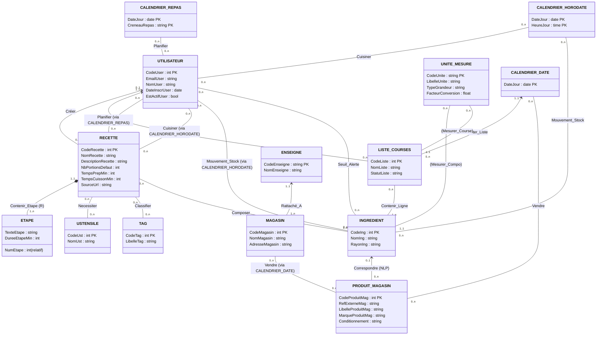

# Modélisation du Système d'Information AdamHUB (Lot 1 : SaaS Cœur)
*Application des principes de Conception de SI & Modélisation de Données (IRIT / Université Toulouse 1 Capitole — Ronan Tournier)*

---

## 1. Démarche Méthodologique & Courbe du Soleil

Le Système d'Information (SI) d'AdamHUB s'insère entre le **Système de Pilotage** (l'utilisateur qui planifie, prend des décisions d'achat et de nutrition) et le **Système Opérant** (l'exécution des courses au drive, la préparation en cuisine, la consommation des aliments).

Conformément à la démarche de la **Courbe du Soleil**, la conception respecte trois niveaux d'abstraction stricts :

```
    Niveau Conceptuel (MCD)   :   QUOI ? (Concepts métier, entités, sémantique, indépendance technologique totale)
             ▲                                     │
             │ (Rétroconception)                   ▼ (Règles formelles de passage)
    Niveau Logique (MLD)      :   COMMENT ? (Modèle relationnel, clés primaires, clés étrangères)
             ▲                                     │
             │                                     ▼ (Implantation technologique)
    Niveau Physique (MPD)     :   AVEC QUOI ? (SGBD PostgreSQL/SQLite, types SQL, SQLModel Python)
```

### Fonctions assurées par le SI sur ce domaine :
1. **Collecter** : Saisie des recettes, extraction automatique d'ingrédients canoniques (NLP), imports web, scan de codes-barres, scraping de catalogues drive.
2. **Mémoriser** : Référentiel des ingrédients, historique des mouvements de stock, historique des prix des magasins, planification des repas, recettes et étapes.
3. **Traiter** : Calcul du stock disponible (somme des entrées moins somme des sorties), détection des ingrédients manquants pour une recette planifiée, calcul des totaux de listes de courses, conversion d'unités de mesure.
4. **Diffuser** : Génération de la liste de courses consolidée, export du panier drive chez l'enseigne sélectionnée, affichage du planning de la semaine.

---

## 2. Dictionnaire des Données

> [!IMPORTANT]
> **Règle d'or du cours (Slide 23 & 24)** :
> Le dictionnaire recense **tous** les attributs manipulés. Les **attributs calculés** y figurent obligatoirement avec leur formule de calcul ou règle de déduction, mais ils sont **strictement interdits dans les modèles conceptuels et logiques (MCD et MLD)** car ils relèvent d'un traitement (requête SQL).

Format recommandé : 4 colonnes (*Nom, Désignation, Type et Format, Contraintes ou Calcul*).

### A. Utilisateurs & Système
| Nom | Désignation | Type et Format | Contraintes ou Calcul |
| :--- | :--- | :--- | :--- |
| `CodeUser` | Identifiant unique d'un utilisateur | Entier | Clé primaire |
| `EmailUser` | Adresse de messagerie de l'utilisateur | Texte CC(255) | Format email valide, Unique |
| `NomUser` | Nom ou pseudonyme affiché | Texte CC(100) | Non nul |
| `DateInscrUser` | Date de création du compte | Date JJ/MM/AAAA | $\le$ Date du jour |
| `EstActifUser` | Indicateur de compte actif | Booléen | Vrai / Faux |

### B. Ingrédients Canoniques & Unités de Mesure
| Nom | Désignation | Type et Format | Contraintes ou Calcul |
| :--- | :--- | :--- | :--- |
| `CodeIng` | Identifiant unique de l'ingrédient canonique | Entier | Clé primaire |
| `NomIng` | Nom normalisé de l'ingrédient (ex: Farine de blé T55) | Texte CC(150) | Unique, non nul |
| `RayonIng` | Catégorie ou rayon d'épicerie | Texte CC(50) | Épicerie, Frais, Surgelé, etc. |
| `CodeUnite` | Code unique identifiant une unité de mesure | Texte CC(10) | Clé primaire (ex: 'g', 'kg', 'ml', 'piece') |
| `LibelleUnite` | Libellé en clair de l'unité | Texte CC(50) | Gramme, Kilogramme, Litre, etc. |
| `TypeGrandeur` | Dimension physique mesurée | Énumération | Masse, Volume, Quantité, Unitaire |
| `FacteurConversion` | Facteur multiplicateur pour conversion en unité de base | Réel | $> 0$ (ex: 1000 pour kg vers g) |
| `StockDisponible` | Quantité nette disponible en réserve | Réel | **ATTRIBUT CALCULÉ** $= \sum(\text{QuantiteEntree}) - \sum(\text{QuantiteSortie})$ |
| `SeuilMinStock` | Quantité minimale avant déclenchement d'alerte | Réel | $\ge 0$ |

### C. Recettes, Étapes, Ustensiles & Tags
| Nom | Désignation | Type et Format | Contraintes ou Calcul |
| :--- | :--- | :--- | :--- |
| `CodeRecette` | Identifiant unique d'une recette | Entier | Clé primaire |
| `NomRecette` | Titre de la recette | Texte CC(150) | Non nul |
| `DescriptionRecette` | Présentation générale du plat | Texte libre | Optionnel |
| `NbPortionsDefaut` | Nombre de parts de base pour les quantités | Entier | $> 0$ |
| `TempsPrepMin` | Temps de préparation en cuisine (minutes) | Entier | $\ge 0$ |
| `TempsCuissonMin` | Temps de cuisson (minutes) | Entier | $\ge 0$ |
| `TempsTotalMin` | Durée totale de réalisation | Entier | **ATTRIBUT CALCULÉ** $= \text{TempsPrepMin} + \text{TempsCuissonMin}$ |
| `SourceUrl` | URL d'origine de la recette (si importée) | Texte CC(500) | Format URL |
| `NumEtape` | Numéro d'ordre de l'étape au sein de la recette | Entier | $\ge 1$ (Identifiant relatif à la recette) |
| `TexteEtape` | Consignes de préparation de l'étape | Texte libre | Non nul |
| `DureeEtapeMin` | Durée estimée de l'étape (minutes) | Entier | $\ge 0$ |
| `QuantiteIngRecette` | Quantité d'ingrédient nécessaire pour le plat | Réel | $> 0$ |
| `NoteIngRecette` | Précision culinaire (ex: "coupé en dés") | Texte CC(100) | Optionnel |
| `CodeUst` | Identifiant unique d'un ustensile | Entier | Clé primaire |
| `NomUst` | Nom de l'ustensile requis (ex: Mixeur plongeant) | Texte CC(100) | Non nul |
| `CodeTag` | Identifiant unique d'une étiquette | Entier | Clé primaire |
| `LibelleTag` | Libellé du tag (ex: Végétarien, Rapide, Italien) | Texte CC(50) | Unique |

### D. Planification des Repas & Cuisson Réelle
| Nom | Désignation | Type et Format | Contraintes ou Calcul |
| :--- | :--- | :--- | :--- |
| `DateJour` | Date calendaire d'un jour | Date JJ/MM/AAAA | Format standard ISO |
| `CreneauRepas` | Moment du repas dans la journée | Énumération | {petit_dejeuner, dejeuner, diner, collation} |
| `HeureJour` | Heure précise d'un événement | Heure HH:MM | $00:00 \le \text{Heure} \le 23:59$ |
| `NbPortionsPlanif` | Nombre de portions prévues pour ce repas | Entier | $> 0$ |
| `NotePlanif` | Consigne ou note sur la planification | Texte CC(255) | Optionnel |
| `NbPortionsCuisinees` | Nombre réel de parts cuisinées | Entier | $> 0$ |
| `CommentaireCuisson` | Retour d'expérience sur la recette réalisée | Texte libre | Optionnel |

### E. Listes de Courses
| Nom | Désignation | Type et Format | Contraintes ou Calcul |
| :--- | :--- | :--- | :--- |
| `CodeListe` | Identifiant unique d'une liste de courses | Entier | Clé primaire |
| `NomListe` | Nom donné à la liste (ex: "Courses du samedi") | Texte CC(100) | Non nul |
| `StatutListe` | État de complétion de la liste | Énumération | {en_cours, terminee, archivee} |
| `QuantiteAcheter` | Quantité prévue sur la liste | Réel | $> 0$ |
| `QuantiteAchetee` | Quantité réellement mise dans le caddie | Réel | $\ge 0$ |
| `EstAchete` | Case à cocher matérialisant l'achat | Booléen | Vrai / Faux (Défaut : Faux) |

### F. Historique des Mouvements de Stock (Garde-Manger Événementiel)
| Nom | Désignation | Type et Format | Contraintes ou Calcul |
| :--- | :--- | :--- | :--- |
| `SensMouv` | Direction du flux d'aliments | Énumération | {Entree, Sortie} |
| `TypeFlux` | Origine métier du mouvement | Énumération | {Achat_Course, Cuisine_Repas, Perime_Jete, Ajustement_Inventaire} |
| `QuantiteMouv` | Quantité physique d'aliment déplacée | Réel | $> 0$ |
| `DatePeremption` | Date limite de consommation du lot entré | Date JJ/MM/AAAA | Optionnelle |
| `EmplacementStock` | Lieu de stockage domestique | Énumération | {Frigo, Placard, Congelateur, Cave} |

### G. Supermarchés, Magasins Physiques & Offres Drive
| Nom | Désignation | Type et Format | Contraintes ou Calcul |
| :--- | :--- | :--- | :--- |
| `CodeEnseigne` | Identifiant de la chaîne de supermarché | Texte CC(20) | Clé primaire (ex: 'CARREFOUR', 'LECLERC') |
| `NomEnseigne` | Nom commercial de l'enseigne | Texte CC(50) | Non nul |
| `CodeMagasin` | Identifiant d'un point de vente / drive | Entier | Clé primaire |
| `NomMagasin` | Nom de l'établissement (ex: Drive Purpan) | Texte CC(150) | Non nul |
| `AdresseMagasin` | Adresse géographique du drive | Texte CC(255) | Non nul |
| `CodeProduitMag` | Identifiant unique produit magasin | Entier | Clé primaire |
| `RefExterneMag` | Code article magasin ou code-barres EAN | Texte CC(50) | Unique par enseigne |
| `LibelleProduitMag` | Intitulé exact sur le site drive | Texte CC(255) | Non nul |
| `MarqueProduitMag` | Marque commerciale ou MDD | Texte CC(100) | Optionnel |
| `Conditionnement` | Format de vente (ex: "Bouteille 1L", "Paquet 500g") | Texte CC(100) | Non nul |
| `DatePrix` | Date de relevé du tarif | Date JJ/MM/AAAA | $\le$ Date du jour |
| `PrixVente` | Prix unitaire en euros au drive ce jour-là | Réel (monétaire) | $> 0$ |
| `IndiceConfianceNLP` | Score de certitude du modèle d'extraction | Réel (pourcentage) | Entre 0.00 et 1.00 |

---

## 3. Modèle Conceptuel de Données (MCD)

### 3.1. Formalisme & Règles Sémantiques Appliquées (MERISE)
- **Classes d'Entités** : Rectangles avec nom en majuscule, identifiant souligné, liste des propriétés élémentaires.
- **Entité Faible / Composition (R)** : `ETAPE` est identifiée relativement à `RECETTE` (slide 38/39).
- **Classes d'Associations** : Ovales avec verbes à l'infinitif, attributs spécifiques portés le cas échéant.
- **Contraintes d'Intégrité Fonctionnelle (CIF)** : Reliées avec une cardinalité maximale de 1 (`(0,1)` ou `(1,1)`).
- **Entités Temporelles "Calendrier"** : Modélisées conformément aux slides 33-37 et 58 pour régler la granularité d'historisation.

### 3.2. Liste des Classes d'Entités
1. `UTILISATEUR` (<u>CodeUser</u>, EmailUser, NomUser, DateInscrUser, EstActifUser)
2. `RECETTE` (<u>CodeRecette</u>, NomRecette, DescriptionRecette, NbPortionsDefaut, TempsPrepMin, TempsCuissonMin, SourceUrl)
3. `ETAPE` [Entité relative à RECETTE] (<u>NumEtape</u>, TexteEtape, DureeEtapeMin)
4. `USTENSILE` (<u>CodeUst</u>, NomUst)
5. `TAG` (<u>CodeTag</u>, LibelleTag)
6. `INGREDIENT` (<u>CodeIng</u>, NomIng, RayonIng)
7. `UNITE_MESURE` (<u>CodeUnite</u>, LibelleUnite, TypeGrandeur, FacteurConversion)
8. `LISTE_COURSES` (<u>CodeListe</u>, NomListe, StatutListe)
9. `ENSEIGNE` (<u>CodeEnseigne</u>, NomEnseigne)
10. `MAGASIN` (<u>CodeMagasin</u>, NomMagasin, AdresseMagasin)
11. `PRODUIT_MAGASIN` (<u>CodeProduitMag</u>, RefExterneMag, LibelleProduitMag, MarqueProduitMag, Conditionnement)
12. `CALENDRIER_REPAS` (<u>DateJour</u>, <u>CreneauRepas</u>)
13. `CALENDRIER_HORODATE` (<u>DateJour</u>, <u>HeureJour</u>)
14. `CALENDRIER_DATE` (<u>DateJour</u>)

---

### 3.3. Schéma Conceptuel Visuel (MCD)



---

### 3.4. Dictionnaire des Classes d'Associations & Rôles Sémantiques

1. **`Créer_Recette`** (Association avec CIF)
   - Relie : `RECETTE` (0,1) et `UTILISATEUR` (0,n).
   - Rôle : *Une recette est créée par au plus un utilisateur (0 si recette publique globale), un utilisateur peut créer plusieurs recettes.*
   - Propriétés : Aucune.

2. **`Composer`** (Association ternaire porteuse)
   - Relie : `RECETTE` (1,n), `INGREDIENT` (0,n), `UNITE_MESURE` (0,n).
   - Rôle : *Une recette est composée d'au moins un ingrédient exprimé dans une unité de mesure.*
   - Propriétés : `QuantiteIngRecette`, `NoteIngRecette`.

3. **`Necessiter`** (Association binaire N-N)
   - Relie : `RECETTE` (0,n) et `USTENSILE` (0,n).
   - Rôle : *Une recette peut nécessiter plusieurs ustensiles, un ustensile peut servir à plusieurs recettes.*

4. **`Classifier`** (Association binaire N-N)
   - Relie : `RECETTE` (0,n) et `TAG` (0,n).
   - Rôle : *Une recette peut recevoir plusieurs étiquettes (ex: Rapide, Économique), un tag s'applique à plusieurs recettes.*

5. **`Planifier`** (Association ternaire avec Calendrier de granularité créneau)
   - Relie : `UTILISATEUR` (0,n), `RECETTE` (0,n), `CALENDRIER_REPAS` (0,n).
   - Rôle : *Un utilisateur planifie une recette pour une date et un créneau précis.*
   - Propriétés : `NbPortionsPlanif`, `NotePlanif`.

6. **`Cuisiner`** (Association d'historisation avec Calendrier horodaté)
   - Relie : `UTILISATEUR` (0,n), `RECETTE` (0,n), `CALENDRIER_HORODATE` (0,n).
   - Rôle : *Un utilisateur consigne la cuisson réelle d'une recette à un instant précis (avec ou sans planification préalable).*
   - Propriétés : `NbPortionsCuisinees`, `CommentaireCuisson`.

7. **`Contenir_Ligne`** (Association ternaire de ligne de course)
   - Relie : `LISTE_COURSES` (1,n), `INGREDIENT` (0,n), `UNITE_MESURE` (0,n).
   - Rôle : *Une liste de courses contient des lignes d'ingrédients à acheter avec une unité.*
   - Propriétés : `QuantiteAcheter`, `QuantiteAchetee`, `EstAchete`.

8. **`Mouvement_Stock`** (Association d'historisation des flux d'aliments)
   - Relie : `UTILISATEUR` (0,n), `INGREDIENT` (0,n), `UNITE_MESURE` (0,n), `CALENDRIER_HORODATE` (0,n).
   - Rôle : *Un flux physique (entrée par courses, sortie par repas cuisiné ou péremption) modifie l'état de stock.*
   - Propriétés : `SensMouv`, `TypeFlux`, `QuantiteMouv`, `DatePeremption`, `EmplacementStock`.

9. **`Seuil_Alerte`** (Association binaire porteuse)
   - Relie : `UTILISATEUR` (0,n) et `INGREDIENT` (0,n).
   - Rôle : *Un utilisateur fixe un seuil critique minimal pour un ingrédient.*
   - Propriétés : `SeuilMinStock`.

10. **`Correspondre`** (Association avec CIF — Résultat du modèle NLP)
    - Relie : `PRODUIT_MAGASIN` (0,1) et `INGREDIENT` (0,n).
    - Rôle : *Un produit spécifique de supermarché correspond à un ingrédient canonique unique.*
    - Propriétés : `IndiceConfianceNLP`.

11. **`Vendre`** (Association avec Historisation de Prix — Slide 80/81)
    - Relie : `MAGASIN` (0,n), `PRODUIT_MAGASIN` (0,n), `CALENDRIER_DATE` (0,n).
    - Rôle : *Un magasin physique vend un produit à un prix fixé à une date donnée.*
    - Propriétés : `PrixVente`.

---

## 4. Modèle Logique de Données (MLD)

### 4.1. Règles de Passage Formelles Appliquées (Slides 54-58)
1. **Classes d'entités ordinaires** : Deviennent des relations (tables). L'identifiant devient clé primaire soulignée.
2. **Entité faible relative (`ETAPE`)** : Devient une relation dont la clé primaire est la combinaison de la clé de l'entité parente et de l'identifiant relatif : `(CodeRecette#, NumEtape)`.
3. **Entités `CALENDRIER` sans attribut** : Exception formelle du cours (slide 54/58) : elles **ne génèrent pas** de table relationnelle autonome. Leurs identifiants migrent directement dans la clé primaire de la relation d'association.
4. **Associations 1-N (CIF)** : Migration de la clé primaire de l'entité côté `(0,n)` ou `(1,n)` vers la relation du côté `(0,1)` ou `(1,1)` sous forme de clé étrangère (notée `#` ou `*`).
5. **Associations N-N et associations porteuses** : Génèrent une nouvelle relation dont la clé primaire est la concaténation des clés étrangères pointant vers les tables liées, augmentée des attributs d'identification temporelle s'il y a historisation.

---

### 4.2. Schéma Relationnel Textuel Formel (MLD)

*Convention du cours : <u>CléPrimaire</u> soulignée, CléÉtrangère annotée `#`.*

```text
UTILISATEURS (
    CodeUser,
    EmailUser,
    NomUser,
    DateInscrUser,
    EstActifUser
)

RECETTES (
    CodeRecette,
    NomRecette,
    DescriptionRecette,
    NbPortionsDefaut,
    TempsPrepMin,
    TempsCuissonMin,
    SourceUrl,
    CodeUser#
)

ETAPES (
    CodeRecette#,
    NumEtape,
    TexteEtape,
    DureeEtapeMin
)

USTENSILES (
    CodeUst,
    NomUst
)

RECETTE_USTENSILES (
    CodeRecette#,
    CodeUst#
)

TAGS (
    CodeTag,
    LibelleTag
)

RECETTE_TAGS (
    CodeRecette#,
    CodeTag#
)

UNITES_MESURE (
    CodeUnite,
    LibelleUnite,
    TypeGrandeur,
    FacteurConversion
)

INGREDIENTS (
    CodeIng,
    NomIng,
    RayonIng
)

RECETTE_COMPOSITIONS (
    CodeRecette#,
    CodeIng#,
    CodeUnite#,
    QuantiteIngRecette,
    NoteIngRecette
)

PLANIFICATIONS (
    CodeUser#,
    CodeRecette#,
    DateJour,
    CreneauRepas,
    NbPortionsPlanif,
    NotePlanif
)

CUISSONS_REELLES (
    CodeUser#,
    CodeRecette#,
    DateJour,
    HeureJour,
    NbPortionsCuisinees,
    CommentaireCuisson
)

LISTES_COURSES (
    CodeListe,
    CodeUser#,
    DateCreation,
    NomListe,
    StatutListe
)

LIGNES_COURSES (
    CodeListe#,
    CodeIng#,
    CodeUnite#,
    QuantiteAcheter,
    QuantiteAchetee,
    EstAchete
)

MOUVEMENTS_STOCK (
    CodeUser#,
    CodeIng#,
    CodeUnite#,
    DateJour,
    HeureJour,
    SensMouv,
    TypeFlux,
    QuantiteMouv,
    DatePeremption,
    EmplacementStock
)

SEUILS_ALERTE (
    CodeUser#,
    CodeIng#,
    SeuilMinStock
)

ENSEIGNES (
    CodeEnseigne,
    NomEnseigne
)

MAGASINS (
    CodeMagasin,
    CodeEnseigne#,
    NomMagasin,
    AdresseMagasin
)

PRODUITS_MAGASIN (
    CodeProduitMag,
    CodeIng#,
    RefExterneMag,
    LibelleProduitMag,
    MarqueProduitMag,
    Conditionnement,
    IndiceConfianceNLP
)

TARIFS_MAGASIN (
    CodeMagasin#,
    CodeProduitMag#,
    DatePrix,
    PrixVente
)
```

---

## 5. Modèle Physique de Données (MPD) : Spécification SQL & Vues des Données Calculées

Le passage au niveau physique instancie les types SQL et matérialise les **traitements** (requêtes SQL) pour les attributs calculés définis au dictionnaire des données.

### 5.1. DDL SQL Résumé (PostgreSQL / SQLite)

```sql
-- 1. Utilisateurs & Ingrédients Canoniques
CREATE TABLE utilisateur (
    code_user SERIAL PRIMARY KEY,
    email VARCHAR(255) UNIQUE NOT NULL,
    nom VARCHAR(100) NOT NULL,
    date_inscription DATE NOT NULL DEFAULT CURRENT_DATE,
    est_actif BOOLEAN NOT NULL DEFAULT TRUE
);

CREATE TABLE unite_mesure (
    code_unite VARCHAR(10) PRIMARY KEY,
    libelle VARCHAR(50) NOT NULL,
    type_grandeur VARCHAR(30) NOT NULL CHECK (type_grandeur IN ('masse', 'volume', 'quantite', 'unitaire')),
    facteur_conversion NUMERIC(10, 4) NOT NULL DEFAULT 1.0
);

CREATE TABLE ingredient (
    code_ing SERIAL PRIMARY KEY,
    nom VARCHAR(150) UNIQUE NOT NULL,
    rayon VARCHAR(50)
);

-- 2. Recettes & Éléments associés (1NF normalisé)
CREATE TABLE recette (
    code_recette SERIAL PRIMARY KEY,
    code_user INT REFERENCES utilisateur(code_user) ON DELETE SET NULL, -- NULL = recette publique
    nom VARCHAR(150) NOT NULL,
    description TEXT,
    nb_portions_defaut INT NOT NULL DEFAULT 4 CHECK (nb_portions_defaut > 0),
    temps_prep_min INT NOT NULL DEFAULT 0 CHECK (temps_prep_min >= 0),
    temps_cuisson_min INT NOT NULL DEFAULT 0 CHECK (temps_cuisson_min >= 0),
    source_url VARCHAR(500)
);

-- Entité faible relative
CREATE TABLE etape (
    code_recette INT NOT NULL REFERENCES recette(code_recette) ON DELETE CASCADE,
    num_etape INT NOT NULL CHECK (num_etape >= 1),
    texte TEXT NOT NULL,
    duree_min INT DEFAULT 0 CHECK (duree_min >= 0),
    PRIMARY KEY (code_recette, num_etape)
);

CREATE TABLE recette_composition (
    code_recette INT NOT NULL REFERENCES recette(code_recette) ON DELETE CASCADE,
    code_ing INT NOT NULL REFERENCES ingredient(code_ing) ON DELETE RESTRICT,
    code_unite VARCHAR(10) NOT NULL REFERENCES unite_mesure(code_unite),
    quantite NUMERIC(10, 2) NOT NULL CHECK (quantite > 0),
    note VARCHAR(100),
    PRIMARY KEY (code_recette, code_ing)
);

-- 3. Planification des Repas & Cuisson (Historisation avec Calendriers)
CREATE TABLE planification (
    code_user INT NOT NULL REFERENCES utilisateur(code_user) ON DELETE CASCADE,
    code_recette INT NOT NULL REFERENCES recette(code_recette) ON DELETE CASCADE,
    date_jour DATE NOT NULL,
    creneau VARCHAR(20) NOT NULL CHECK (creneau IN ('petit_dejeuner', 'dejeuner', 'diner', 'collation')),
    nb_portions INT NOT NULL CHECK (nb_portions > 0),
    note VARCHAR(255),
    PRIMARY KEY (code_user, code_recette, date_jour, creneau)
);

CREATE TABLE cuisson_reelle (
    code_user INT NOT NULL REFERENCES utilisateur(code_user) ON DELETE CASCADE,
    code_recette INT NOT NULL REFERENCES recette(code_recette) ON DELETE CASCADE,
    date_jour DATE NOT NULL,
    heure_jour TIME NOT NULL,
    nb_portions INT NOT NULL CHECK (nb_portions > 0),
    commentaire TEXT,
    PRIMARY KEY (code_user, code_recette, date_jour, heure_jour)
);

-- 4. Garde-Manger Événementiel (Mouvements de Stock)
CREATE TABLE mouvement_stock (
    code_user INT NOT NULL REFERENCES utilisateur(code_user) ON DELETE CASCADE,
    code_ing INT NOT NULL REFERENCES ingredient(code_ing) ON DELETE RESTRICT,
    code_unite VARCHAR(10) NOT NULL REFERENCES unite_mesure(code_unite),
    date_jour DATE NOT NULL,
    heure_jour TIME NOT NULL,
    sens VARCHAR(10) NOT NULL CHECK (sens IN ('entree', 'sortie')),
    type_flux VARCHAR(30) NOT NULL CHECK (type_flux IN ('achat_course', 'cuisine_repas', 'perime_jete', 'ajustement_inventaire')),
    quantite NUMERIC(10, 2) NOT NULL CHECK (quantite > 0),
    date_peremption DATE,
    emplacement VARCHAR(20) CHECK (emplacement IN ('frigo', 'placard', 'congelateur', 'cave')),
    PRIMARY KEY (code_user, code_ing, code_unite, date_jour, heure_jour)
);

-- 5. Listes de Courses & Articles
CREATE TABLE liste_courses (
    code_liste SERIAL PRIMARY KEY,
    code_user INT NOT NULL REFERENCES utilisateur(code_user) ON DELETE CASCADE,
    date_creation DATE NOT NULL DEFAULT CURRENT_DATE,
    nom VARCHAR(100) NOT NULL,
    statut VARCHAR(20) NOT NULL DEFAULT 'en_cours' CHECK (statut IN ('en_cours', 'terminee', 'archivee'))
);

CREATE TABLE ligne_courses (
    code_liste INT NOT NULL REFERENCES liste_courses(code_liste) ON DELETE CASCADE,
    code_ing INT NOT NULL REFERENCES ingredient(code_ing) ON DELETE RESTRICT,
    code_unite VARCHAR(10) NOT NULL REFERENCES unite_mesure(code_unite),
    quantite_prevue NUMERIC(10, 2) NOT NULL CHECK (quantite_prevue > 0),
    quantite_achetee NUMERIC(10, 2) DEFAULT 0 CHECK (quantite_achetee >= 0),
    est_achete BOOLEAN NOT NULL DEFAULT FALSE,
    PRIMARY KEY (code_liste, code_ing)
);

-- 6. Supermarchés & Tarifs
CREATE TABLE enseigne (
    code_enseigne VARCHAR(20) PRIMARY KEY,
    nom VARCHAR(50) NOT NULL
);

CREATE TABLE magasin (
    code_magasin SERIAL PRIMARY KEY,
    code_enseigne VARCHAR(20) NOT NULL REFERENCES enseigne(code_enseigne) ON DELETE CASCADE,
    nom VARCHAR(150) NOT NULL,
    adresse VARCHAR(255) NOT NULL
);

CREATE TABLE produit_magasin (
    code_produit_mag SERIAL PRIMARY KEY,
    code_ing INT REFERENCES ingredient(code_ing) ON DELETE SET NULL, -- Mapping NLP
    ref_externe VARCHAR(50) NOT NULL,
    libelle VARCHAR(255) NOT NULL,
    marque VARCHAR(100),
    conditionnement VARCHAR(100) NOT NULL,
    indice_confiance_nlp NUMERIC(3, 2) CHECK (indice_confiance_nlp BETWEEN 0 AND 1)
);

CREATE TABLE tarif_magasin (
    code_magasin INT NOT NULL REFERENCES magasin(code_magasin) ON DELETE CASCADE,
    code_produit_mag INT NOT NULL REFERENCES produit_magasin(code_produit_mag) ON DELETE CASCADE,
    date_prix DATE NOT NULL,
    prix_vente NUMERIC(10, 2) NOT NULL CHECK (prix_vente > 0),
    PRIMARY KEY (code_magasin, code_produit_mag, date_prix)
);
```

---

### 5.2. Vues SQL pour les Attributs Calculés (Traitements)

Puisque les attributs calculés sont exclus des modèles conformément au cours, ils sont matérialisés par des requêtes SQL réutilisables :

#### 1. Vue `v_stock_disponible` (Calcul du Stock Réel Net)
```sql
CREATE VIEW v_stock_disponible AS
SELECT 
    m.code_user,
    m.code_ing,
    i.nom AS nom_ingredient,
    m.code_unite,
    SUM(CASE WHEN m.sens = 'entree' THEN m.quantite ELSE -m.quantite END) AS stock_disponible
FROM mouvement_stock m
JOIN ingredient i ON m.code_ing = i.code_ing
GROUP BY m.code_user, m.code_ing, i.nom, m.code_unite;
```

#### 2. Vue `v_recette_duree` (Durée Totale de la Recette)
```sql
CREATE VIEW v_recette_duree AS
SELECT 
    code_recette,
    nom,
    temps_prep_min,
    temps_cuisson_min,
    (temps_prep_min + temps_cuisson_min) AS temps_total_min
FROM recette;
```

#### 3. Traitement : Ingrédients Manquants pour un Repas Planifié
```sql
-- Calcule les ingrédients dont la quantité requise dépasse le stock actuel pour un utilisateur
SELECT 
    p.code_user,
    p.date_jour,
    p.creneau,
    r.nom AS nom_recette,
    i.code_ing,
    i.nom AS nom_ingredient,
    (rc.quantite * p.nb_portions / r.nb_portions_defaut) AS quantite_requise,
    COALESCE(s.stock_disponible, 0) AS stock_actuel,
    rc.code_unite,
    GREATEST(0, (rc.quantite * p.nb_portions / r.nb_portions_defaut) - COALESCE(s.stock_disponible, 0)) AS quantite_manquante
FROM planification p
JOIN recette r ON p.code_recette = r.code_recette
JOIN recette_composition rc ON r.code_recette = rc.code_recette
JOIN ingredient i ON rc.code_ing = i.code_ing
LEFT JOIN v_stock_disponible s 
    ON s.code_user = p.code_user 
   AND s.code_ing = rc.code_ing 
   AND s.code_unite = rc.code_unite
WHERE ((rc.quantite * p.nb_portions / r.nb_portions_defaut) - COALESCE(s.stock_disponible, 0)) > 0;
```

---

## 6. Synthèse des Écarts et Alignement du Code Existé

| Éléments Existants dans AdamHUB | Modélisation Cible (Cours de Ronan Tournier) | Justification Académique |
| :--- | :--- | :--- |
| Tables `pantryitem`, `groceryitem`, `recipeingredient` avec champs dupliqués (`name`, `unit`, métadonnées drive). | Entité centrale unique `INGREDIENT` canonique reliée par des associations `COMPOSER`, `LIGNE_COURSES` et `MOUVEMENT_STOCK`. | Suppression des redondances de données, garantie de cohérence globale du SI. |
| Clés artificielles `id` auto-incrémentées sur toutes les tables de liaison. | Clés primaires composées (`CodeRecette#`, `CodeIng#`) ou identification relative pour `ETAPE`. | Règle formelle de passage MCD ➔ MLD (Slide 55/56). |
| Colonnes `JSONB` (`steps`, `utensils`, `tags`). | Décomposition en entités `ETAPE`, `USTENSILE`, `TAG` et tables associatives. | Respect de la Première Forme Normale (1NF) et modélisation conceptuelle pure (Slide 22). |
| Table `SupermarketMapping` avec clés polymorphes (`target_type`, `target_id`). | Association directe `CORRESPONDRE` entre `PRODUIT_MAGASIN` et `INGREDIENT`. | Élimination de l'anti-pattern polymorphe incompatible avec les contraintes d'intégrité relationnelles (CIF). |
| Stock modifié par mise à jour destructive en place (`quantity` écrasée). | Journal d'événements `MOUVEMENT_STOCK` avec `StockActuel` calculé par requête SQL. | Règle d'or : interdiction des attributs calculés dans les modèles ; traçabilité totale et historique (Slide 33-36). |
| Planification avec horodatages arbitraires. | Granularité temporelle explicite via `CALENDRIER_REPAS(Date, Creneau)`. | Modélisation propre des calendriers et de la granularité (Slide 37, 58). |
