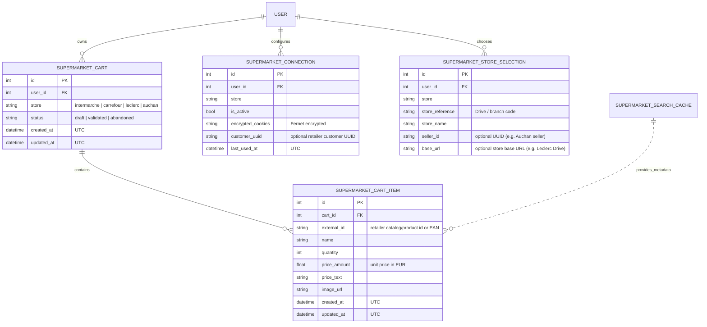

# Data Model: Multi-Store Supermarket Carts

## Entities & Relationships



---

## Entity Specifications

### 1. `SupermarketCart`
Represents the local mirror of a user's basket for a specific supermarket retailer.

- **Storage**: Table `supermarketcart` (SQLModel).
- **Multi-Tenant Scoping**: Foreign key `user_id` indexed, scoped to `CurrentOrOwnerUser`.
- **Fields**:
  - `id`: `int`, primary key.
  - `user_id`: `int`, indexed, non-null foreign key to `user.id`.
  - `store`: `SupermarketStore` enum (`intermarche`, `carrefour`, `leclerc`, `auchan`).
  - `status`: `CartStatus` enum (`draft`, `validated`, `abandoned`). Defaults to `draft`.
  - `created_at`: `datetime`, UTC timestamp of first interaction.
  - `updated_at`: `datetime`, UTC timestamp of last remote synchronization.

### 2. `SupermarketCartItem`
An individual line item within a supermarket cart mirror.

- **Storage**: Table `supermarketcartitem` (SQLModel).
- **Fields**:
  - `id`: `int`, primary key.
  - `cart_id`: `int`, foreign key to `supermarketcart.id` with cascade deletion.
  - `external_id`: `str`, retailer internal identifier (e.g. short catalog ID for Intermarché/Leclerc, UUID/EAN for Carrefour/Auchan).
  - `name`: `str`, descriptive product label.
  - `quantity`: `int`, non-negative integer. If quantity reaches 0, the row is removed.
  - `price_amount`: `float`, unit price in Euros.
  - `price_text`: `str`, human-readable price string (e.g. "2,45 €", "1,58 € / L").
  - `image_url`: `str`, URL of product thumbnail.
  - `created_at`: `datetime`, UTC timestamp.
  - `updated_at`: `datetime`, UTC timestamp.

---

## State Transitions & Mirror Invariants

### 1. Remote Mirroring Invariant
```
[User / Agent Action]
       │
       ▼
[Retailer Remote Call via Adapter]
       │
       ├─► Success ──► [verbatim replace_items in SupermarketCart] ──► Return Cart (200)
       │
       └─► Failure ──► [abort, leave SupermarketCart unchanged]   ──► Return HTTP Error (4xx/5xx)
```

- **Verification**: At no point can a local cart item be committed if the remote retailer call fails.
- **Quantity Zero**: A mutation requesting `quantity = 0` triggers an item removal on the retailer site. Upon successful response, the item is dropped from local state.
- **Full Clear**: A clear cart operation executes a remote cart wipe (e.g. `DELETE` or empty payload) and replaces local items with an empty list.
