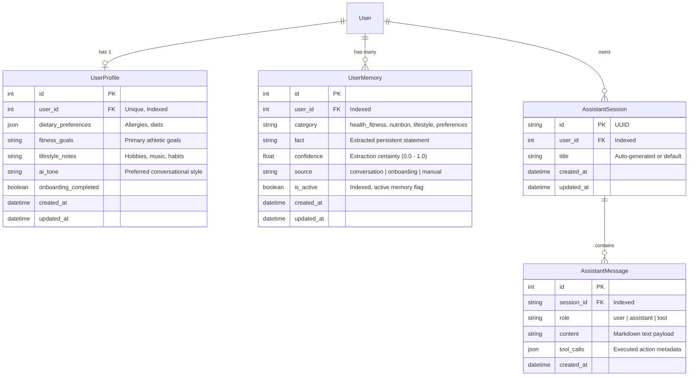

# Data Model: Mobile AI Agent & Context Engine

**Feature**: `002-mobile-ai-agent`
**Date**: 2026-09-12

---

## 1. Entities & Schema Definitions



---

## 2. Detailed Field Specifications

### Entity: `UserProfile`
Represents the durable baseline configuration entered during onboarding or profile editing.
- `id` (int, Primary Key)
- `user_id` (int, Foreign Key → `user.id`, Unique, Indexed): Guarantees strict multi-tenant isolation.
- `dietary_preferences` (JSON / List of strings): e.g. `["halal", "sans-lactose", "pas-d-arachides"]`.
- `fitness_goals` (string, max 500 chars): e.g. *"Prise de masse musculaire, 4 séances hebdomadaires, focus développé militaire"*.
- `lifestyle_notes` (string, max 1000 chars): Personal traits, e.g. *"Écoute de la drill et du rap US pour le sport, télétravail les mardis et jeudis"*.
- `ai_tone` (string, default `"direct"`): Values: `"direct"`, `"motivating"`, `"concise"`, `"warm"`.
- `onboarding_completed` (boolean, default `False`): Tracks whether the initial profile wizard has run.
- `created_at` (datetime, UTC, default now)
- `updated_at` (datetime, UTC, default now)

### Entity: `UserMemory`
Represents fine-grained, autonomous observations captured across conversations.
- `id` (int, Primary Key)
- `user_id` (int, Foreign Key → `user.id`, Indexed)
- `category` (string, Indexed): Options: `health_fitness`, `nutrition`, `lifestyle`, `preferences`.
- `fact` (string, max 1000 chars): Clear, declarative fact in French or user language.
- `confidence` (float, default 1.0): Assessment score from extraction model.
- `source` (string, default `"conversation"`): Options: `"conversation"`, `"onboarding"`, `"manual"`.
- `is_active` (boolean, default `True`, Indexed): Soft deletion / invalidation flag. When an updated fact contradicts an old one, the old entry is marked `is_active = False`.
- `created_at` (datetime, UTC)
- `updated_at` (datetime, UTC)

### Entity: `AssistantSession` & `AssistantMessage`
Ephemeral or persistent chat conversation representation.
- Stored on server to support cross-device resume if needed, with instant "Reset" operation deleting or archiving active messages.
- `tool_calls` contains structured execution results so the client can re-render action cards on reload.

---

## 3. Dynamic Runtime Snapshot Model (`ContextSnapshot`)

In-memory Python Pydantic structure compiled in FastAPI before dispatching to the LLM:

```python
class ContextSnapshot(BaseModel):
    current_time_utc: datetime
    formatted_local_time: str
    user_profile: UserProfileRead
    active_memories: list[UserMemoryRead]
    today_tasks_pending: list[TaskSummary]
    today_events: list[CalendarEventSummary]
    next_planned_meal: MealPlanSummary | None
    low_stock_pantry_items: list[PantrySummary]
```

### Prompt Compilation Rules
1. **Header**: Role identity (AdamHUB Copilot) and communication tone.
2. **Persistent Memories Section**: Bullet list grouped by category (`[Santé/Sport]`, `[Nutrition]`, `[Lifestyle]`).
3. **Working Context Section**: Current date/time, top 3 pending tasks, next calendar commitment, next planned meal, pantry stock warnings.
4. **Tool Access Rules**: Instructions on when and how to call tools from `ACTION_CATALOG` (`task.create`, `grocery.item.create`, `fitness.session.create`, etc.).
