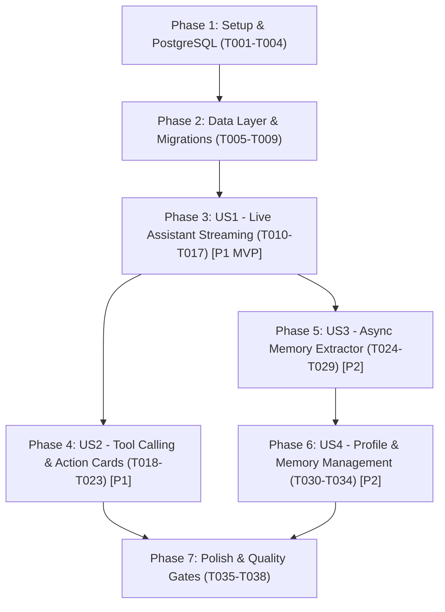

# Tasks: Mobile AI Agent & Context Engine

**Feature**: `002-mobile-ai-agent`
**Input**: Design documents from `/specs/002-mobile-ai-agent/` (spec.md, plan.md, data-model.md, contracts/assistant-api.yaml, quickstart.md)

---

## Phase 1: Setup & Environment Standardization

**Purpose**: Establish 100% PostgreSQL standard via Podman and configure OpenRouter integration

- [X] T001 Verify rootless Podman engine and ensure PostgreSQL 16 service is defined in `docker-compose.yml`
- [X] T002 Configure OpenRouter and PostgreSQL environment variables in `.env.example` and `app/core/config.py`
- [X] T003 Update database connection initialization to reject SQLite fallbacks in non-dev modes in `app/core/db.py`
- [X] T004 [P] Configure pytest fixture `test_engine` to connect to PostgreSQL `adamhub_test` running under Podman in `tests/conftest.py`

---

## Phase 2: Foundational Data Layer & Core Contracts

**Purpose**: Shared persistent models, database migrations, and API schemas required before user stories

**⚠️ CRITICAL**: Must be completed before User Story implementation begins

- [X] T005 Create `UserProfile` entity with fields `user_id` (int, foreign key to user.id, unique, indexed), `dietary_preferences` (JSON list), `fitness_goals` (string max 500), `lifestyle_notes` (string max 1000), `ai_tone` (string default "direct"), and `onboarding_completed` (bool default False) in `app/models/entities.py`
- [X] T006 Create `UserMemory` entity with fields `user_id` (int, foreign key to user.id, indexed), `category` (string, indexed), `fact` (string max 1000), `confidence` (float default 1.0), `source` (string default "conversation"), and `is_active` (bool default True, indexed) in `app/models/entities.py`
- [X] T007 Generate and apply Alembic migration adding `userprofile` and `usermemory` tables for PostgreSQL in `alembic/versions/m2c1a9f4e8b0_add_user_profile_and_memory.py`
- [X] T008 [P] Implement Pydantic request/response schemas for Assistant chat, profile, and memories in `app/schemas/assistant.py`
- [X] T009 [P] Register and mount assistant router prefix `/assistant` in `app/api/router.py`

**Checkpoint**: Core PostgreSQL schemas and tables exist; user story implementation can begin

---

## Phase 3: User Story 1 - Context-Aware Mobile Assistant Interaction (Priority: P1) 🎯 MVP

**Goal**: Enable real-time streaming conversational assistant on mobile injecting live schedule, pantry stock, and user profile

**Independent Test**: Send a question about lunch in the mobile app; verify the assistant streams an answer referencing active profile goals and pantry stock in < 1.2s

### Tests for User Story 1
- [X] T010 [P] [US1] Integration test for context snapshot compilation and live SSE streaming response in `tests/test_assistant_chat.py`

### Implementation for User Story 1
- [X] T011 [P] [US1] Implement `ContextBuilder` compiling current UTC time, top tasks, next meal, and pantry alerts into a prompt digest in `app/services/assistant/context_builder.py`
- [X] T012 [P] [US1] Implement asynchronous OpenRouter streaming client using `httpx.AsyncClient` supporting model switching in `app/services/assistant/openrouter_client.py`
- [X] T013 [US1] Implement endpoint `POST /api/v1/assistant/chat` streaming Server-Sent Events (SSE) via FastAPI `StreamingResponse` in `app/api/assistant.py`
- [X] T014 [P] [US1] Implement SSE stream reader and API client wrapper in `app-saas/src/lib/assistant-api.ts`
- [X] T015 [P] [US1] Create chat message bubble component rendering progressive markdown and streaming state in `app-saas/src/components/assistant/chat-message.tsx`
- [X] T016 [US1] Create full-screen assistant modal with message stream and prompt input in `app-saas/src/app/assistant.tsx`
- [X] T017 [US1] Wire central AI button in bottom navigation bar to open assistant modal in `app-saas/src/app/(tabs)/_layout.tsx`

**Checkpoint**: User Story 1 is functional; user can chat with the assistant with live streaming on mobile

---

## Phase 4: User Story 2 - Natural Language Action Execution (Priority: P1)

**Goal**: Allow assistant to execute cross-domain mutations (tasks, groceries, fitness events) via tool calling with interactive confirmation cards

**Independent Test**: Instruct the assistant to add groceries and schedule a workout; verify items are created in the database and confirmation cards appear in the chat

### Tests for User Story 2
- [X] T018 [P] [US2] Contract and integration test verifying tool execution and SSE tool events in `tests/test_assistant_tools.py`

### Implementation for User Story 2
- [X] T019 [P] [US2] Implement tool schema serializer converting `ACTION_CATALOG` entries to OpenAI function calling definitions in `app/services/assistant/openrouter_client.py`
- [X] T020 [US2] Implement tenant-scoped tool execution dispatcher invoking `app.skill.actions.execute_action` during streaming in `app/services/assistant/tool_dispatcher.py`
- [X] T021 [US2] Update `POST /api/v1/assistant/chat` to emit structured `tool_call` and `tool_result` SSE events in `app/api/assistant.py`
- [X] T022 [P] [US2] Create interactive action confirmation card component for tasks, groceries, and calendar events in `app-saas/src/components/assistant/action-card.tsx`
- [X] T023 [US2] Integrate action card rendering into message stream in `app-saas/src/app/assistant.tsx`

**Checkpoint**: User Story 2 is functional; assistant can safely execute actions on behalf of the user

---

## Phase 5: User Story 3 - Ephemeral Sessions & Async Memory Extractor (Priority: P2)

**Goal**: Autonomous background extraction of durable user facts into `UserMemory` with instant session reset capability

**Independent Test**: Mention a specific physical constraint (e.g. shoulder injury); verify immediate answer, verify background insertion into `user_memories`, reset session, and verify the memory is referenced in the next query

### Tests for User Story 3
- [X] T024 [P] [US3] Test asynchronous memory extraction background task and contradiction resolution in `tests/test_user_memory.py`

### Implementation for User Story 3
- [X] T025 [P] [US3] Implement asynchronous memory extraction service evaluating conversation turns for durable facts in `app/services/assistant/memory_extractor.py`
- [X] T026 [US3] Hook memory extraction into `POST /api/v1/assistant/chat` as a non-blocking FastAPI `BackgroundTask` in `app/api/assistant.py`
- [X] T027 [US3] Inject active `UserMemory` records into `ContextBuilder` system prompt in `app/services/assistant/context_builder.py`
- [X] T028 [US3] Implement session reset endpoint `POST /api/v1/assistant/session/reset` in `app/api/assistant.py`
- [X] T029 [US3] Add "Nouvelle session" / Reset button in mobile assistant header clearing local state in `app-saas/src/app/assistant.tsx`

**Checkpoint**: User Story 3 is functional; autonomous memory extraction works in the background with zero user-facing latency

---

## Phase 6: User Story 4 - Profile & Lifestyle Customization (Priority: P2)

**Goal**: User-facing profile settings and transparent memory management allowing users to inspect and revoke remembered facts

**Independent Test**: Navigate to settings, view extracted memories, delete one memory, and verify that the deleted memory is marked inactive and omitted from future prompts

### Tests for User Story 4
- [X] T030 [P] [US4] Test profile update and memory CRUD endpoints in `tests/test_assistant_profile.py`

### Implementation for User Story 4
- [X] T031 [P] [US4] Implement CRUD endpoints `GET/PUT /api/v1/assistant/profile` and `GET/POST/DELETE /api/v1/assistant/memories/{id}` in `app/api/assistant.py`
- [X] T032 [P] [US4] Create memory tag pill component with dismiss/delete button in `app-saas/src/components/assistant/memory-tag.tsx`
- [X] T033 [US4] Create AI memory and profile management screen in `app-saas/src/app/settings-memories.tsx`
- [X] T034 [US4] Add navigation link to memory settings from user account view in `app-saas/src/app/(tabs)/account.tsx`

**Checkpoint**: User Story 4 is functional; user has full transparency and control over their AI memory and profile

---

## Phase 7: Polish, Verification & Quality Gates

**Purpose**: Cross-cutting quality checks across backend and mobile client

- [ ] T035 [P] Verify complete backend test suite passes against PostgreSQL via Podman with `ADAMHUB_ENV=test uv run --extra dev pytest`
- [X] T036 [P] Run typecheck and linter on mobile app with `cd app-saas && npm run typecheck && npm run lint`
- [X] T037 Execute manual validation scenarios documented in `specs/002-mobile-ai-agent/quickstart.md`
- [X] T038 Synchronize assistant documentation in `adamhub-assistant/SKILL.md` and domain docs

---

## Dependencies & Execution Order

### Parallel Opportunities

- **Phase 1**: T004 can run in parallel with T002-T003.
- **Phase 2**: T008 and T009 can run in parallel with T007.
- **Phase 3 (US1)**: T011, T012, T014, and T015 can be implemented in parallel once T010 is ready.
- **Phase 4 (US2)**: T019 and T022 can be implemented in parallel with backend endpoints.
- **Phase 5 (US3)**: T024 test and T025 extractor can be developed in parallel.
- **Phase 6 (US4)**: T030 test, T031 backend endpoints, and T032 mobile components can be built in parallel.
- **Phase 7**: T035 (pytest) and T036 (mobile typecheck) can run in parallel.

---

## Implementation Strategy

### 1. MVP Scope (User Story 1)
- Complete Phase 1 (PostgreSQL via Podman) + Phase 2 (Foundational data layer).
- Implement User Story 1 (Phase 3).
- **Result**: Working mobile chat modal in `app-saas` streaming contextual responses from OpenRouter based on user profile and live schedule.

### 2. Incremental Delivery
- Add User Story 2 (Tool Calling): Assistant executes real mutations (groceries, tasks, workout schedule) with interactive visual feedback cards.
- Add User Story 3 (Async Memory Extractor): Background worker captures user facts seamlessly with one-tap session reset.
- Add User Story 4 (Profile & Memory Management): User-facing transparency screen to view and delete remembered facts.
- Final Polish: Full test suite passing against PostgreSQL with zero SQLite remnants.
