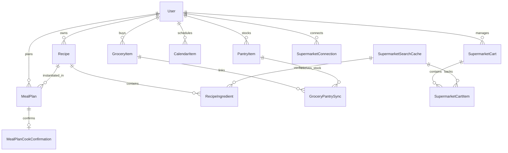

# Data Model: Assistant Comprehensive Tooling & Smart Scheduling

**Feature**: `003-assistant-comprehensive-tooling`
**Date**: 2026-09-12
**Status**: Complete

---

## 1. Core Domain Entities



---

## 2. Entity Definitions

### Recipe (`app.models.entities.Recipe`)
Represents a culinary preparation with preparation and cooking metadata.
- `id`: `int` (Primary Key)
- `user_id`: `int` (Foreign Key to `User.id`, Indexed, Tenant-isolated)
- `name`: `str` (Recipe title, e.g. "Risotto aux champignons")
- `description`: `str | None`
- `instructions`: `str` (Narrative preparation text)
- `steps`: `list[str]` (Ordered sequence of discrete cooking steps)
- `utensils`: `list[str]` (Kitchen tools required)
- `prep_minutes`: `int` (Preparation time)
- `cook_minutes`: `int` (Cooking time)
- `servings`: `int` (Default yield count, min 1)
- `tags`: `list[str]` (e.g. `["dîner", "italien", "rapide"]`)
- `source_url`: `str | None`
- `source_transcript`: `str | None` (Used for AI intake / YouTube extraction)
- `created_at`: `datetime` (UTC)
- `updated_at`: `datetime` (UTC)

### RecipeIngredient (`app.models.entities.RecipeIngredient`)
Discrete ingredient line within a recipe.
- `id`: `int` (Primary Key)
- `recipe_id`: `int` (Foreign Key to `Recipe.id`, Indexed)
- `name`: `str` (Ingredient name, e.g. "Riz arborio")
- `quantity`: `float` (Target amount, > 0)
- `unit`: `str` (e.g. "g", "kg", "ml", "L", "item", "cuillère")
- `note`: `str | None`
- `category`: `str | None`
- `cache_id`: `int | None` (Foreign Key to `SupermarketSearchCache.id`)
- `store`: `SupermarketStore | None`
- `store_label`: `str | None`
- `external_id`: `str | None` (Authentic retailer reference)
- `price_text`: `str | None`

### CalendarItem (`app.models.entities.CalendarItem`)
Represents a scheduled slot on the unified timeline.
- `id`: `int` (Primary Key)
- `user_id`: `int` (Foreign Key to `User.id`, Indexed)
- `title`: `str`
- `start_at`: `datetime` (UTC timestamp)
- `end_at`: `datetime` (UTC timestamp, must be > `start_at`)
- `category`: `CalendarCategory` (`general`, `task`, `meal`, `fitness`, `event`)
- `source`: `CalendarSource` (`manual`, `task`, `meal_plan`, `fitness`, `event`)
- `source_ref_id`: `int | None`
- `generated`: `bool` (False for manual entries, True for projections)
- `completed`: `bool`
- `created_at`: `datetime` (UTC)

### MealPlan & MealPlanCookConfirmation (`app.models.entities.MealPlan`, `MealPlanCookConfirmation`)
- `MealPlan`:
  - `id`: `int` (Primary Key)
  - `user_id`: `int` (Foreign Key to `User.id`, Indexed)
  - `planned_at`: `datetime` (UTC)
  - `recipe_id`: `int` (Foreign Key to `Recipe.id`)
  - `servings_override`: `int | None`
  - `auto_add_missing_ingredients`: `bool` (Default: True)
  - `synced_grocery_at`: `datetime | None`
- `MealPlanCookConfirmation`:
  - `id`: `int` (Primary Key)
  - `meal_plan_id`: `int` (Foreign Key to `MealPlan.id`, Unique)
  - `confirmed_at`: `datetime` (UTC)
  - `pantry_consumption`: `list[dict]` (Lot consumption records storing `{pantry_item_id, name, consumed_qty, unit}` for exact restoration)

---

## 3. Ephemeral Detection & Orchestration Entities

### ScheduleConflict (Detection DTO)
Generated during calendar slot validation when collisions are detected without `force=True`.
```json
{
  "conflict": true,
  "message": "Créneau occupé par un ou plusieurs événements existants.",
  "colliding_items": [
    {
      "title": "Rendez-vous dentiste",
      "start_at": "2026-09-13T10:30:00Z",
      "end_at": "2026-09-13T11:30:00Z",
      "category": "event",
      "source": "manual"
    }
  ],
  "suggested_slots": [
    {
      "start_at": "2026-09-13T11:30:00Z",
      "end_at": "2026-09-13T12:30:00Z",
      "label": "Immédiatement après le conflit"
    },
    {
      "start_at": "2026-09-13T09:00:00Z",
      "end_at": "2026-09-13T10:00:00Z",
      "label": "Avant le conflit le même jour"
    }
  ]
}
```

### ConsolidatedActionSummary (Response DTO)
Consolidated multi-action execution feedback for the assistant conversational UI.
- `completed_actions`: `list[str]` (e.g. `["recipe.add", "meal_plan.add", "grocery.add_item"]`)
- `entities_created`: `dict[str, list[str]]` (e.g. `{"recipes": ["Risotto"], "meal_plans": ["Jeudi 19h"], "groceries": ["Riz arborio", "Champignons"]}`)
- `warnings_or_conflicts`: `list[str]`
- `next_suggested_prompts`: `list[str]`

---

## 4. State Transitions & Invariants

| Action | Entity Affected | Invariant / Validation | Reversible? |
|---|---|---|---|
| `recipe.add` | `Recipe`, `RecipeIngredient` | Name & instructions required; quantities > 0. Never creates Task. | Yes (`recipe.delete`) |
| `recipe.delete` | `Recipe`, `RecipeIngredient` | Explicit confirmation required in conversational flow. | No |
| `calendar.add_item` (`force=False`) | `CalendarItem` | Fails with structured `ScheduleConflict` if overlap detected. | N/A |
| `calendar.add_item` (`force=True`) | `CalendarItem` | Bypasses collision rejection; stores with warning flag. | Yes (`calendar.delete_item`) |
| `recipe.confirm_cooked` | `PantryItem`, `MealPlanCookConfirmation` | Decrements pantry stock proportionally. Clamps at 0. Stores consumption lots. | Yes (`recipe.unconfirm_cooked`) |
| `recipe.unconfirm_cooked` | `PantryItem`, `MealPlanCookConfirmation` | Re-adds exact consumed quantities from stored lots. Deletes confirmation row. | Yes |
| `supermarket.add_cart_item` | `SupermarketCartItem` | Requires authentic `cache_id`. Enforces remote retailer sync. | Yes (`supermarket.remove_cart_item`) |
