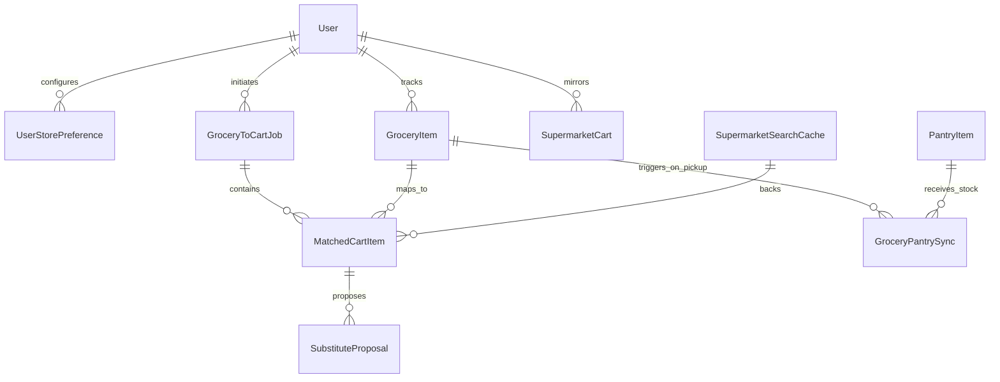
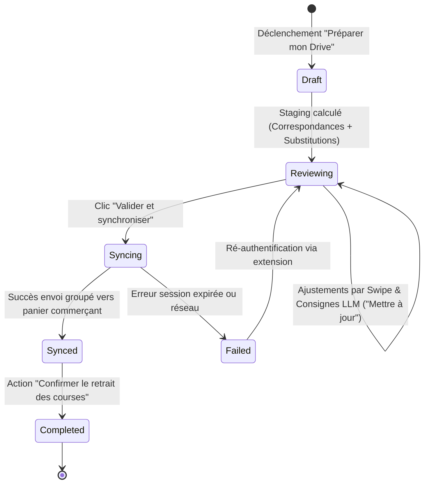
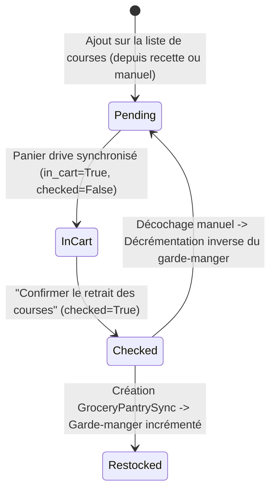

# Data Model: Sélection du Magasin Drive et Synchronisation du Panier

**Branch**: `004-supermarket-drive-store-selection-cart-sync`
**Date**: 2026-09-13
**Spec Reference**: `specs/004-supermarket-drive-store-selection-cart-sync/spec.md`

---

## Entity Relationship Diagram

---

## Entities

### 1. `UserStorePreference`
Associe durablement un utilisateur à son point de retrait favori pour une enseigne donnée, avec conservation de sa stratégie d'optimisation.

| Champ | Type | Contrainte | Description |
|-------|------|------------|-------------|
| `id` | `int` | PK | Identifiant interne |
| `user_id` | `int` | FK `user.id`, Index, Non-null | Tenant propriétaire (Principe I) |
| `store` | `SupermarketStore` | Enum, Index, Non-null | `leclerc`, `auchan`, `carrefour`, `intermarche` |
| `external_store_id` | `str` | Non-null | Identifiant distributeur (ex. seller_id, pdvId, code magasin) |
| `store_label` | `str` | Non-null | Nom commercial (ex. "E.Leclerc Blagnac") |
| `location_label` | `str` | Nullable | Complément d'adresse ou commune |
| `pickup_type` | `str` | Non-null, Default `'quai'` | `quai`, `spot`, `tape`, `pieton` (FR-002) |
| `optimization_strategy` | `str` | Non-null, Default `'mdd'` | `mdd`, `budget`, `bio` (FR-007) |
| `channel` | `str` | Nullable | Canal distributeur (ex. 'drive', 'pieton') |
| `raw_context` | `JSON` | Default `{}` | Paramètres techniques de routage et cookies de session |
| `created_at` | `datetime` | UTC, Non-null | Horodatage de création |
| `updated_at` | `datetime` | UTC, Non-null | Horodatage de dernière modification |

**Contrainte d'unicité** : `UniqueConstraint("user_id", "store", name="uq_user_store_preference")`

---

### 2. `GroceryToCartJob`
Représente une session de transformation de la liste de courses vers un panier drive (staging local puis synchronisation distante).

| Champ | Type | Contrainte | Description |
|-------|------|------------|-------------|
| `id` | `int` | PK | Identifiant du job |
| `user_id` | `int` | FK `user.id`, Index, Non-null | Tenant propriétaire (Principe I) |
| `store` | `SupermarketStore` | Enum, Index, Non-null | Enseigne cible |
| `external_store_id` | `str` | Non-null | Identifiant du magasin drive utilisé |
| `status` | `str` | Non-null, Default `'draft'` | `draft`, `reviewing`, `syncing`, `synced`, `completed`, `failed` |
| `optimization_strategy` | `str` | Non-null, Default `'mdd'` | Stratégie appliquée lors de la génération |
| `items_count` | `int` | Default `0` | Nombre total d'articles traités |
| `matched_count` | `int` | Default `0` | Nombre d'articles appariés avec succès |
| `substitutes_count` | `int` | Default `0` | Nombre de propositions de substitution |
| `unmatched_count` | `int` | Default `0` | Nombre d'articles non trouvés |
| `estimated_total_cents` | `int` | Default `0` | Coût total estimé du panier en centimes d'euro |
| `error_message` | `str` | Nullable | Message d'erreur si échec réseau/authentification |
| `synced_at` | `datetime` | UTC, Nullable | Horodatage de la synchronisation réussie vers le commerçant |
| `completed_at` | `datetime` | UTC, Nullable | Horodatage de confirmation du retrait au drive |
| `created_at` | `datetime` | UTC, Non-null | Horodatage de création |
| `updated_at` | `datetime` | UTC, Non-null | Horodatage de mise à jour |

---

### 3. `MatchedCartItem`
Article individuel apparié dans le cadre d'un job de staging local.

| Champ | Type | Contrainte | Description |
|-------|------|------------|-------------|
| `id` | `int` | PK | Identifiant de la ligne |
| `job_id` | `int` | FK `grocerytocartjob.id`, Index | Job parent |
| `grocery_item_id` | `int` | FK `groceryitem.id`, Nullable | Article source sur la liste de courses |
| `cache_id` | `int` | FK `supermarketsearchcache.id`, Nullable | Ligne de catalogue réel garantissant l'authenticité (Principe II) |
| `external_id` | `str` | Nullable | Référence SKU commerçant |
| `name` | `str` | Non-null | Désignation exacte du produit |
| `brand` | `str` | Nullable | Marque du produit |
| `packaging` | `str` | Nullable | Conditionnement (ex. "Barquette 500g") |
| `image_url` | `str` | Nullable | Visuel produit |
| `product_url` | `str` | Nullable | Fiche produit commerçant |
| `quantity` | `float` | Non-null, Default `1.0` | Quantité calculée en unités de vente |
| `unit_price_cents` | `int` | Default `0` | Prix unitaire en centimes |
| `total_price_cents` | `int` | Default `0` | Prix total en centimes |
| `match_type` | `str` | Non-null, Default `'mdd'` | `exact_history`, `mdd`, `budget`, `bio`, `substitute`, `manual` |
| `status` | `str` | Non-null, Default `'staged'` | `staged`, `to_modify`, `removed`, `synced` |
| `custom_note` | `str` | Nullable | Remarque/consigne utilisateur pour ajustement LLM (ex. "sans sucre") |
| `created_at` | `datetime` | UTC, Non-null | Horodatage de création |
| `updated_at` | `datetime` | UTC, Non-null | Horodatage de mise à jour |

---

### 4. `SubstituteProposal`
Alternative suggérée lorsqu'un produit habituel est en rupture de stock.

| Champ | Type | Contrainte | Description |
|-------|------|------------|-------------|
| `id` | `int` | PK | Identifiant de la proposition |
| `matched_item_id` | `int` | FK `matchedcartitem.id`, Index | Ligne concernée |
| `alternative_cache_id` | `int` | FK `supermarketsearchcache.id`, Non-null | Produit de remplacement issu du catalogue réel |
| `alternative_name` | `str` | Non-null | Nom de l'alternative |
| `alternative_brand` | `str` | Nullable | Marque de l'alternative |
| `alternative_unit_price_cents`| `int` | Non-null | Prix unitaire du substitut |
| `price_difference_cents` | `int` | Non-null | Différence de prix (+/- centimes) |
| `reason` | `str` | Non-null | Motif (ex. "Même catégorie, conditionnement équivalent") |
| `status` | `str` | Non-null, Default `'pending'` | `pending`, `accepted`, `rejected` |
| `created_at` | `datetime` | UTC, Non-null | Horodatage de proposition |

---

### 5. Évolution de `GroceryItem`
Maintien de la rétro-compatibilité avec ajout du statut d'acheminement :
- `in_cart: bool = Field(default=False, index=True)` : Indique que l'article a été synchronisé vers un panier drive sans être encore physiquement récupéré.
- `checked: bool = Field(default=False, index=True)` : Reste l'unique déclencheur invariant de réapprovisionnement du garde-manger (`GroceryPantrySync`).

---

## State Transition Diagrams

### 1. Cycle de vie du Job (`GroceryToCartJob`)

### 2. Cycle de vie de l'article de courses (`GroceryItem`)

