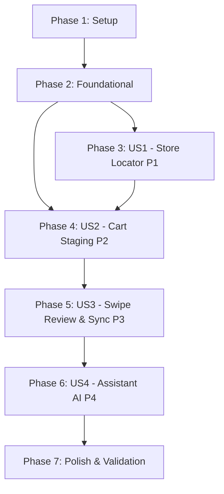

# Tasks: Sélection du Magasin Drive et Synchronisation du Panier depuis la Liste de Courses

**Branch**: `004-supermarket-drive-store-selection-cart-sync`
**Feature Directory**: `specs/004-supermarket-drive-store-selection-cart-sync`
**Date**: 2026-09-13
**Spec**: [spec.md](spec.md) | **Plan**: [plan.md](plan.md) | **Data Model**: [data-model.md](data-model.md)

---

## Phase 1: Setup (Shared Infrastructure)

**Purpose**: Initialiser les répertoires de code, modules TypeScript et structures communes.

- [X] T001 Create project directories for supermarket domain services in `app/services/supermarket/`, `app-saas/src/components/`, and `app-saas/src/lib/`
- [X] T002 [P] Define TypeScript API types for store locations, store preferences, cart jobs, and review items in `app-saas/src/lib/supermarket-api.ts`
- [X] T003 [P] Define TypeScript types and state interfaces for web store selection and cart review in `web/src/types/supermarket.ts`

---

## Phase 2: Foundational (Blocking Prerequisites)

**Purpose**: Modèles de données persistants, migrations de base de données et schémas Pydantic.

**⚠️ CRITICAL**: Aucun développement d'histoire utilisateur ne peut commencer avant la complétion de cette phase.

- [X] T004 Create persistent SQLModel entities `UserStorePreference` (with `user_id: int` indexed FK, `store: SupermarketStore`, `external_store_id: str`, `store_label: str`, `pickup_type: str = 'quai'`, `optimization_strategy: str = 'mdd'`, and compound `uq_user_store_preference`), `GroceryToCartJob`, `MatchedCartItem`, and `SubstituteProposal` in `app/models/entities.py`
- [X] T005 Add `in_cart: bool = Field(default=False, index=True)` delivery status column to `GroceryItem` in `app/models/entities.py`
- [X] T006 [P] Create Alembic database migration script for `userstorepreference`, `grocerytocartjob`, `matchedcartitem`, `substituteproposal` tables and `groceryitem.in_cart` in `alembic/versions/`
- [X] T007 [P] Implement Pydantic request and response schemas for store location search, store preferences, cart jobs, matched items, and batch refinement adjustments in `app/schemas/supermarket.py`
- [X] T008 Export new models and schemas in `app/models/__init__.py` and `app/schemas/__init__.py`

**Checkpoint**: Base de données et schémas prêts — l'implémentation des User Stories peut débuter.

---

## Phase 3: User Story 1 - Recherche et Configuration du Magasin Drive Favori (Priority: P1) 🎯 MVP

**Goal**: Permettre à l'utilisateur de rechercher un point de retrait (quai standard, spot déporté, borne TAPE, drive piéton) par code postal ou commune pour Leclerc, Auchan, Carrefour et Intermarché, et de sauvegarder son drive favori par tenant.

**Independent Test**: Rechercher "31700" / "Blagnac", sélectionner une borne TAPE ou un drive quai, vérifier la sauvegarde sous `UserStorePreference` pour l'utilisateur connecté, et vérifier que deux utilisateurs distincts obtiennent leurs propres magasins respectifs (Principe I).

### Tests for User Story 1
- [X] T009 [P] [US1] Implement contract and integration tests for store search and user store preferences (`/stores/search`, `/stores/preferences`) in `tests/test_supermarket_store_locator.py`

### Implementation for User Story 1
- [X] T010 [P] [US1] Implement Leclerc store locator scraper adapter returning store list with types (`quai`, `spot`, `tape`, `pieton`) in `app/services/scrapers/leclerc.py`
- [X] T011 [P] [US1] Implement Carrefour store locator scraper adapter filtering drive points in `app/services/scrapers/carrefour.py`
- [X] T012 [P] [US1] Implement Intermarché point of sale locator adapter resolving `pdvId` in `app/services/scrapers/intermarche.py`
- [X] T013 [US1] Implement unified `SupermarketStoreLocator` service aggregating and normalizing store search across the 4 retailers in `app/services/supermarket/store_locator.py`
- [X] T014 [US1] Implement FastAPI endpoints `GET /api/v1/supermarket/stores/search`, `GET /api/v1/supermarket/stores/preferences`, and `PUT /api/v1/supermarket/stores/preferences/{store}` in `app/api/endpoints/supermarket.py`
- [X] T015 [P] [US1] Implement mobile store selection modal component `supermarket-store-modal.tsx` with retailer tabs, postal code search, and pickup type badges in `app-saas/src/components/supermarket-store-modal.tsx`
- [X] T016 [P] [US1] Implement web store selector component in `web/src/components/SupermarketStoreSelector.tsx`
- [X] T017 [US1] Integrate store selector into user settings and profile in `app-saas/src/app/account.tsx` and `web/src/pages/GroceriesPage.tsx`

**Checkpoint**: User Story 1 (MVP) est fonctionnelle de bout en bout et testable de façon autonome.

---

## Phase 4: User Story 2 - Génération du Panier Drive depuis la Liste de Courses (Priority: P2)

**Goal**: Transformer automatiquement les ingrédients génériques de la liste de courses en un panier brouillon local (`GroceryToCartJob`), en résolvant chaque article vers le catalogue réel du drive sélectionné selon la stratégie d'optimisation (MDD par défaut, budget strict ou bio).

**Independent Test**: Constituer une liste de 10 articles variés non cochés, déclencher la création du panier pour le magasin configuré, vérifier la création du job en base avec correspondances réelles (`cache_id`), calcul des quantités commerciales et coût estimé, sans aucune écriture prématurée chez le commerçant distant.

### Tests for User Story 2
- [X] T018 [P] [US2] Implement unit and integration tests for generic ingredient mapping, optimization strategies (MDD, budget, bio), and staging creation in `tests/test_grocery_cart_job.py`

### Implementation for User Story 2
- [X] T019 [US2] Implement `CartMatcherService` resolving generic ingredients to real store SKUs using verified mappings first, then `SupermarketSearchCache` scored by optimization strategy (`mdd`, `budget`, `bio`) in `app/services/supermarket/cart_matcher.py`
- [X] T020 [US2] Implement `CartJobService.create_draft_job` creating `GroceryToCartJob` and `MatchedCartItem`s in `draft`/`reviewing` status without mutating remote retailer carts in `app/services/supermarket/cart_job_service.py`
- [X] T021 [US2] Implement FastAPI endpoints `POST /api/v1/supermarket/cart/jobs` and `GET /api/v1/supermarket/cart/jobs/{id}` in `app/api/endpoints/supermarket.py`
- [X] T022 [US2] Add dedicated "Préparer mon Drive" button in the header next to "Ajouter un article" in `app-saas/src/app/(tabs)/kitchen.tsx`, opening the store selection and staging modal
- [X] T023 [P] [US2] Add "Préparer mon Drive" button and modal trigger on the web groceries interface in `web/src/pages/GroceriesPage.tsx`

**Checkpoint**: User Story 2 est fonctionnelle : le panier brouillon local est généré instantanément en tâche de fond.

---

## Phase 5: User Story 3 - Gestion des Équivalents, Revue par Swipe & Validation (Priority: P3)

**Goal**: Permettre à l'utilisateur de visualiser les substitutions, d'ajuster les produits par gestes de swipe (swipe gauche pour supprimer, swipe droite pour ouvrir le modal de modification avec alternatives et consigne texte LLM), de mettre à jour le panier en tâche de fond, de synchroniser vers le panier distant, et de confirmer le retrait pour réapprovisionner le garde-manger.

**Independent Test**: Générer un job avec un produit en rupture, vérifier la proposition de substitut avec écart de prix, tester la suppression par swipe, tester l'ajout d'une consigne texte avec recalcule par LLM ("Mettre à jour le panier"), synchroniser vers le panier distant (vérifier `in_cart = True`, `checked = False`), puis appeler `confirm-pickup` et vérifier que les articles passent `checked = True` et génèrent les liaisons `GroceryPantrySync` dans le garde-manger (Principe III).

### Tests for User Story 3
- [X] T024 [P] [US3] Implement tests for swipe adjustments, batch LLM refinement, remote cart push, `in_cart` status, and pickup pantry restock in `tests/test_cart_review_and_sync.py`

### Implementation for User Story 3
- [X] T025 [US3] Implement `CartJobService.refine_job` executing batch LLM adjustment prompt for items marked "À modifier" and updating the staging draft in `app/services/supermarket/cart_job_service.py`
- [X] T026 [US3] Implement `CartJobService.sync_remote_cart` batch-pushing validated items to remote retailer cart via `cart_mirror` and setting `GroceryItem.in_cart = True` (`checked = False`) in `app/services/supermarket/cart_job_service.py`
- [X] T027 [US3] Implement `CartJobService.confirm_pickup` setting `GroceryItem.checked = True`, creating `GroceryPantrySync` records, and incrementing `PantryItem` stock (Principe III) in `app/services/supermarket/cart_job_service.py`
- [X] T028 [US3] Implement FastAPI endpoints `POST /jobs/{id}/refine`, `POST /jobs/{id}/sync`, and `POST /jobs/{id}/confirm-pickup` in `app/api/endpoints/supermarket.py`
- [X] T029 [P] [US3] Implement mobile swipeable item row `cart-item-swipeable.tsx` (swipe gauche: supprimer, swipe droite: modal de modification) in `app-saas/src/components/cart-item-swipeable.tsx`
- [X] T030 [P] [US3] Implement mobile item modification modal `cart-item-edit-modal.tsx` with alternative products list and custom instruction text input for LLM in `app-saas/src/components/cart-item-edit-modal.tsx`
- [X] T031 [US3] Implement mobile cart review panel `cart-review-modal.tsx` with items list, "Mettre à jour le panier", "Valider et synchroniser", and "Confirmer le retrait" buttons in `app-saas/src/components/cart-review-modal.tsx`
- [X] T032 [P] [US3] Implement web interactive cart review panel with alternatives selector, custom notes, and remote sync buttons in `web/src/components/CartReviewPanel.tsx`

**Checkpoint**: User Stories 1, 2 et 3 sont complètes : cycle de vie complet du panier drive et respect absolu des invariants de stocks.

---

## Phase 6: User Story 4 - Déclenchement et Pilotage par l'Assistant IA (Priority: P4)

**Goal**: Permettre à l'assistant personnel en langage naturel de configurer le magasin drive favori et de préparer le panier de courses avec bilan synthétique et confirmation directe.

**Independent Test**: Envoyer une consigne vocale/texte "Configure mon drive Leclerc à Blagnac" et "Prépare mon panier drive pour cette semaine", vérifier les réponses synthétiques et la mise à jour des entités correspondantes.

### Tests for User Story 4
- [X] T033 [P] [US4] Implement unit and integration tests for supermarket assistant tools in `tests/test_assistant_supermarket_tools.py`

### Implementation for User Story 4
- [X] T034 [US4] Implement assistant skill actions `supermarket.search_stores`, `supermarket.set_favorite_store`, `supermarket.prepare_cart`, `supermarket.confirm_cart_sync`, and `supermarket.confirm_pickup` in `app/skill/actions.py`
- [X] T035 [P] [US4] Register supermarket tool handlers in the MCP server in `app/mcp/server.py`
- [X] T036 [P] [US4] Update assistant instructions and action catalog documentation in `adamhub-assistant/SKILL.md` and `adamhub-assistant/references/action-catalog.md`

**Checkpoint**: Toutes les User Stories sont complètes et pilotables par interface graphique ou assistant IA.

---

## Phase 7: Polish & Cross-Cutting Concerns

**Purpose**: Validation de conformité, durcissement multi-tenant, documentation et scénarios de validation.

- [X] T037 [P] Implement strict multi-tenant isolation tests verifying HTTP 404 on cross-tenant access to store preferences and cart jobs in `tests/test_supermarket_multi_tenant.py`
- [X] T038 [P] Document user guide for supermarket drive selection and cart synchronization in `docs/features/supermarket-drive-sync.md`
- [X] T039 Execute quickstart validation scenarios (`quickstart.md`) and verify zero test regressions with `uv run --extra dev pytest`

---

## Dependencies & Execution Order

### Phase Dependencies



### User Story Dependencies

- **User Story 1 (P1 - MVP)**: Dépend uniquement de Phase 2 (Foundational). Peut être livrée et testée de manière 100% indépendante.
- **User Story 2 (P2)**: Dépend de US1 pour le contexte magasin sélectionné. Peut être testée avec un magasin mocké ou configuré.
- **User Story 3 (P3)**: Dépend du job de staging produit par US2 pour exécuter la revue par swipe, la synchronisation distante et le réapprovisionnement.
- **User Story 4 (P4)**: Dépend des services de US1, US2 et US3 pour encapsuler les actions dans les outils de l'assistant.

---

## Parallel Execution Examples

### User Story 1 (P1)
```bash
# Lancer les adaptateurs de scrapers en parallèle :
Task: "T010 [P] [US1] Implement Leclerc store locator scraper adapter"
Task: "T011 [P] [US1] Implement Carrefour store locator scraper adapter"
Task: "T012 [P] [US1] Implement Intermarché point of sale locator adapter"

# Lancer les composants d'interface en parallèle :
Task: "T015 [P] [US1] Implement mobile store selection modal component"
Task: "T016 [P] [US1] Implement web store selector component"
```

### User Story 3 (P3)
```bash
# Lancer les composants UI de revue en parallèle :
Task: "T029 [P] [US3] Implement mobile swipeable item row cart-item-swipeable.tsx"
Task: "T030 [P] [US3] Implement mobile item modification modal cart-item-edit-modal.tsx"
Task: "T032 [P] [US3] Implement web interactive cart review panel CartReviewPanel.tsx"
```

---

## Implementation Strategy

### MVP First (User Story 1)
1. Exécuter Phase 1 (Setup) et Phase 2 (Foundational).
2. Exécuter Phase 3 (User Story 1).
3. **STOP & VALIDATE** : Vérifier que l'utilisateur peut chercher un drive (quai, spot, TAPE, piéton) et enregistrer son magasin favori. Déployable comme premier incrément autonome.

### Incréments suivants
1. Ajouter User Story 2 : Préparation du panier local en tâche de fond avec mapping générique → catalogue réel.
2. Ajouter User Story 3 : Ergonomie par Swipe, modal d'ajustement avec consigne LLM, envoi groupé et réapprovisionnement au retrait.
3. Ajouter User Story 4 : Déclenchement par l'assistant IA et outils MCP.
4. Finaliser Phase 7 : Validation `quickstart.md` et validation multi-surfaces.
